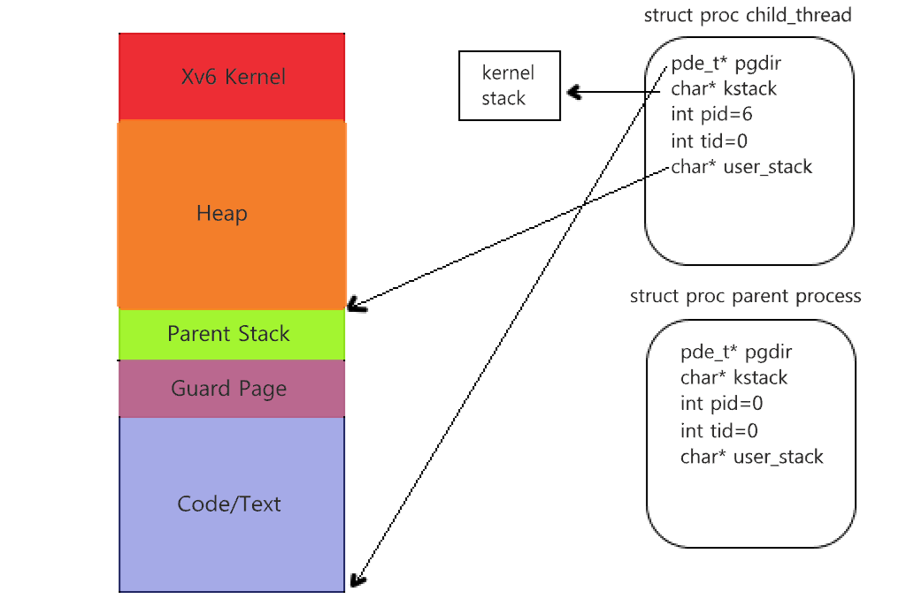
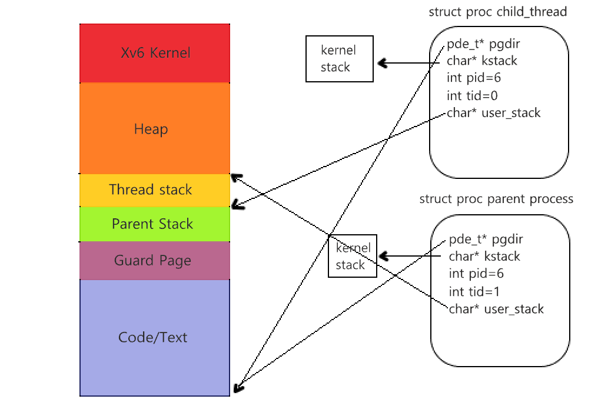

# Threading Support in Xv6

**Authors:** Ali Momen, Mobin Barfi

## Introduction
### What are threads?
Within a program, a Thread is a separate execution path. It is a lightweight process that the operating system can schedule and run concurrently with other threads. The operating system creates and manages threads, and they share the same memory and resources as the program that created them. This enables multiple threads to collaborate and work efficiently within a single program. Each such thread has its own CPU state and stack, but they share the address space of the process and the environment.

### Project Overview
The aim of this project was to add threading support in xv6 via adding kernel threads. The core idea is to add 2 main system calls `Clone` and `Join`. After that, we had to implement Locks to ensure the safety of the execution of our threads. Finally, we programmed a file called `Test-Thread` to test the functionality of our program.

## System Calls
### Clone
This call creates a new kernel thread which shares the calling process's address space. File descriptors are copied as in `fork()`. The new process uses stack as its user stack, which is passed two arguments (`arg1` and `arg2`) and uses a fake return PC (0xffffffff); a proper thread will simply call `exit()` when it is done (and not return). The stack should be one page in size and page-aligned. In our implementation of this system call, the parent would allocate 4096 bytes (1 page) of dynamic memory using `malloc` and set the pointer pointing at the child's stack to this block of memory.

New Members added to `struct proc`:
- `int tid`: New Thread Id
- `char *tstack`: Thread stack
- `int Is-Thread`: Set to 1 if it is a thread
- `int Thread-Num`: The number of threads of a process

### Join
The other new system call is `int join(int tid)`. This call waits for a child thread that shares the address space with the calling process to exit. It returns 1 upon success and 0 if failed. After the `join` system call, the user stack dynamically allocated by the parent will be freed. It is really good to mention that the kernel stack allocated for this thread will be freed when `exit()` is called.

### Wrappers and a few details
In our implementation, there are 2 user functions called:
1. `int thread-create(void (*worker)(int*, int*), int* arg1, int* arg2)`
2. `int thread-join(int thread-id)`

These 2 functions serve as wrappers to the `clone` and `join` system calls.

Now I would like to show the changes before and after creating a thread in the virtual address space of the parent process:

*Figure 1: Virtual address space before clone*

*Figure 2: Virtual address space after clone*

## Lock system
### Lock-init
For the safety of our program and conserving the logic of our code, we need to implement a lock system (spin lock). There should be a type lock that one uses to declare a lock, and two routines (`lock-acquire` and `lock-release`). One last routine, `void lock-init(lock *)`, is used to initialize the lock as need be (it should only be called by one thread).
It will set the Is_Locked member of our struct to 1

### Lock-acquire
The `lock-acquire(lock*)` is the function responsible for taking the lock if available if not it will loop over and over until the lock is released.Mainly this is possible using xchgl instruction written in x86.h file.

### Lock-release
The `lock-release(lock*)` is the function responsible for releasing the lock.
It would set Is_Locked member to zero atomically using movl assembly instruction.

## Test-Program
In our implementation, we added 2 new C files that use the user-space functions `thread-create` and `thread-join` to test the multithreaded functionality.
### Test-Thread.c
This C code is a simple multi-threaded program that calculates the expression 2x + 1 for three different threads, where x is the thread ID (tid) passed to each thread as its second argument. The program uses a simple locking mechanism to ensure that threads don't interfere with each other while accessing shared resources.
### Test-Thread2.c
This C code is a simple program that uses two locks (P2_Perm and P1_Perm) to control the order of execution between two threads (p1 and p2). The program prints a sequence of letters in a specific order by coordinating the execution of the two threads using locks.

